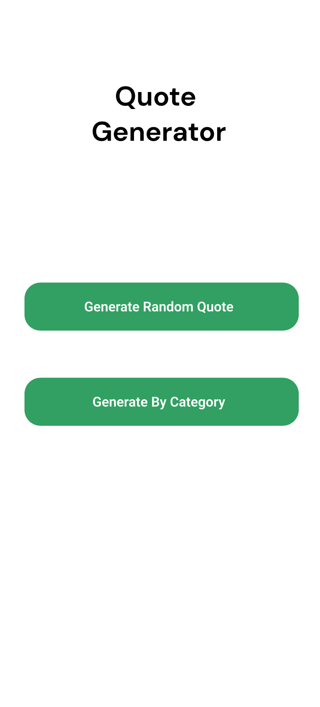
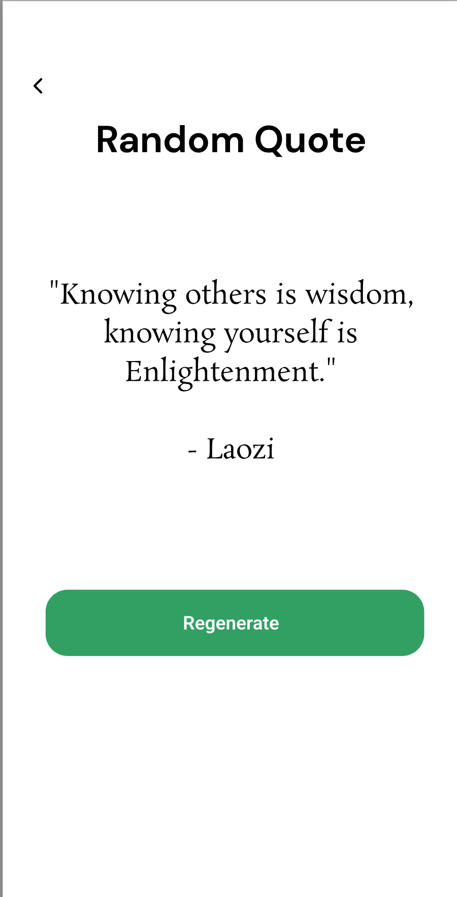
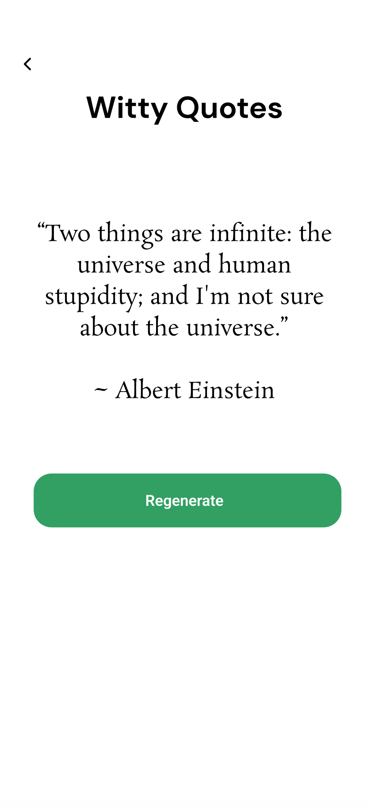
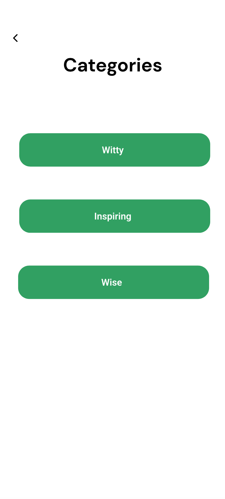

# Main Function

QuoteGenerator is an app that is intended to just help generate quotes.

It can create a random quote as a placeholder or for personal use.

It is in this sense similar to BrainyQuote but in mobile application form. 

# Secondary function

The secondary function is selecting a category and viewing quotes related to that category.

# Navigation

The main page allows the user to navigate to either a page to generate a random quote or to select a category.

Navigation back to the previous page is done through a back button.

# Wireframe

 
 
 
 
<!-- 

 -->