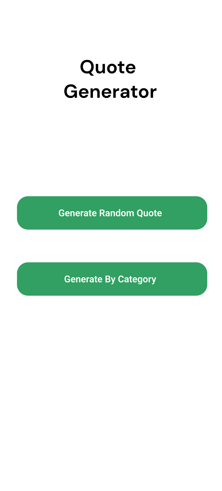
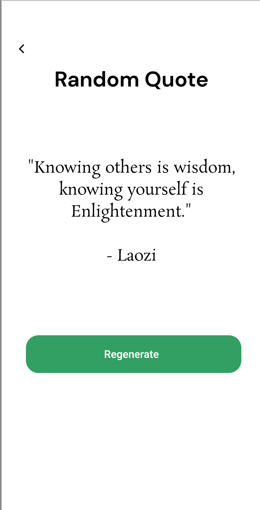
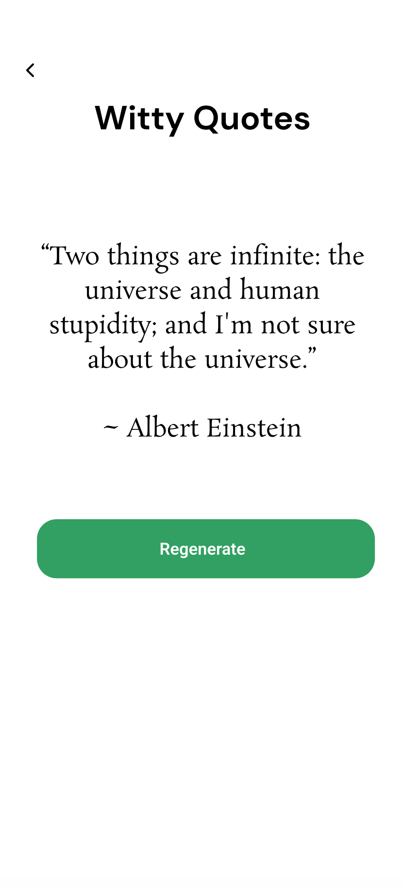
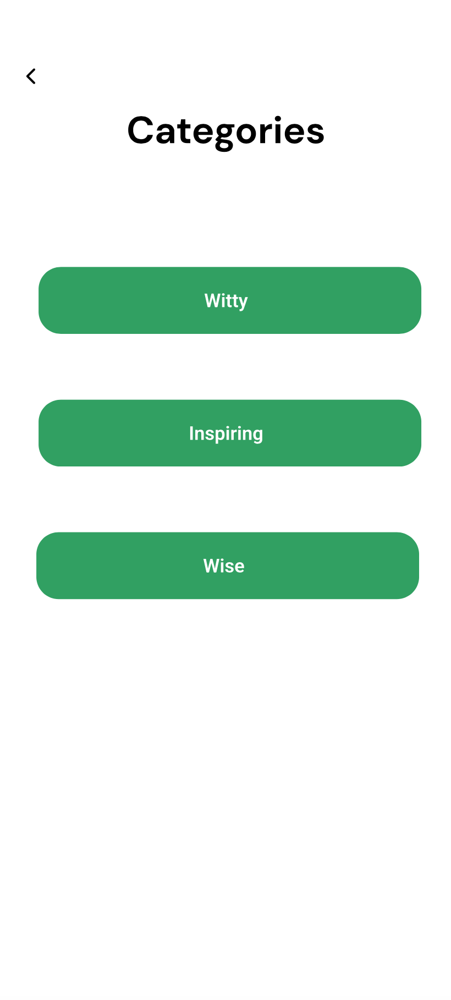

# Main Function

QuoteGenerator is an app that is intended to just help generate quotes.

It can create a random quote as a placeholder or for personal use.

It is in this sense similar to BrainyQuote but in mobile application form. 

# Secondary function

The secondary function is selecting a category and viewing quotes related to that category.

# Navigation

The main page allows the user to navigate to either a page to generate a random quote or to select a category.

Navigation back to the previous page is done through a back button.

# Wireframe

 
 
 
 

# Use of Web Services

This app uses HTTP requests to fetch quotes from the Quote Garden API. This allows for not only fetching individual or random quotes, but also for selecting by category or author.

# Explanation for layout

This app uses a minimalist layout in order to avoid overcomplicating it, and since the use cases are all simple.

Since the functionalities of generating a random quote and generating a quote by category are separate, it made the most sense to use a layout where navigation is done by simply going back in the order of the pages until returning to the main page.